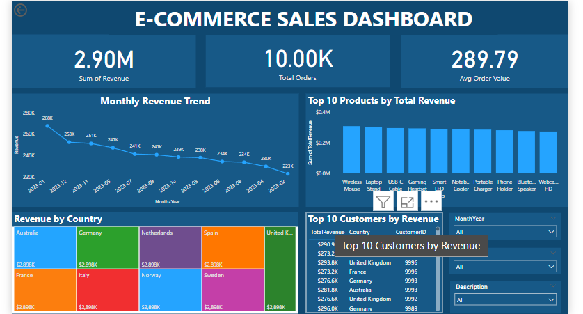

# 🛒 E-Commerce Sales Dashboard

An interactive dashboard project analyzing e-commerce sales performance using **SQL**, **Python (Pandas)**, and **Power BI**.

---

## 📊 Project Overview

This project analyzes a sample e-commerce dataset to extract meaningful business insights such as:

- Total Revenue & Orders
- Average Order Value
- Sales Trend over Time
- Top Products, Customers & Countries
- Interactive Filters and Drill-through capabilities

---

## 🧰 Tools & Technologies Used

- **SQL** – Data cleaning and transformation
- **Python (Pandas)** – Exploratory data analysis (EDA)
- **Power BI** – Data visualization and dashboard creation

---

 📷 Dashboard Preview



---


## 📁 Project Structure

```
ecommerce_dashboard/
├── README.md
├── data/
│   └── ecommerce_data.csv
├── sql/
│   └── data_cleaning_queries.sql
├── python/
│   └── exploratory_analysis.ipynb
├── powerbi/
│   └── ecommerce_dashboard.pbix
└── images/
    └── dashboard_preview.png
```

---

## 📸 Dashboard Preview


---

## 📈 Key Insights

- 📅 Monthly revenue trends clearly identify peak seasons.
- 🌍 Highest revenue-generating countries highlighted via map visuals.
- 🛍 Top-selling products and high-value customers identified.

---

## ▶️ How to Use

1. **Clone the Repo**  
   ```bash
   git clone https://github.com/aaditi43/ecommerce_dashboard.git
   cd ecommerce_dashboard
   ```

2. **SQL**  
   Run `data_cleaning_queries.sql` in MySQL Workbench to transform the raw data.

3. **Python (Jupyter Notebook)**  
   Use `exploratory_analysis.ipynb` to explore the data using Pandas.

4. **Power BI**  
   Open `ecommerce_dashboard.pbix` in Power BI Desktop to explore the visuals.

---

## 📌 Credits

Created by Aditi | Inspired by common e-commerce analytics use cases.

---

## 📜 License

This project is for educational purposes.
